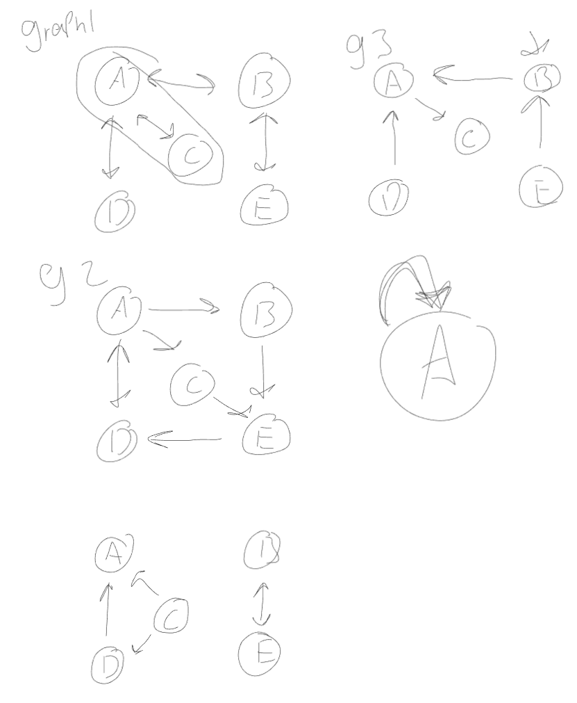

# Detecting Cycles in Graphs

Kruskal's Algorithm adds edges to the minimum spanning tree, unless they would
add a cycle. In the lectures, we did not talk about how to do this -- you're
going to implement a function to detect cycles in a graph. Start with the
template I provided in `code.js`. You can use any data structures (i.e. any
graph representation) you like. The function should return `true` or `false`,
depending on whether the given graph contains a cycle or not.

I have not provided any test code, but you can base yours on test code from
other exercises. Your tests must check the correctness of the result of running
the function and run automatically when you commit through a GitHub action.

## Runtime Analysis

What is the worst-case big $\Theta$ complexity of your implementation? Add your
answer, including your reasoning, to this markdown file.

 hand done tests

I literally copied and pasted my depthfirst search code and just added a forloop that iterates though every node in the graph and searches for cycles, this forloop had to be added to account for islands in the graph.

so my Analysis of mine should be |v| * (depthfirst serch analysis) so $|v| * |v|^2 \in \theta(|v|^3)$

I certify that I have listed all sources used to complete this exercise, including the use of any Large Language Models. All of the work is my own, except where stated otherwise. I am aware that plagiarism carries severe penalties and that if plagiarism is suspected, charges may be filed against me without prior notice.